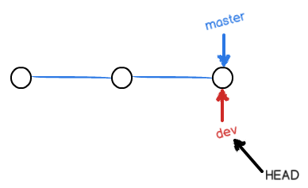

# Git学习笔记

## 1. 在Windows上安装Git

在windows上使用Git，可以从Git官网直接[下载安装程序](https://git-scm.com/)，如果觉得Git官网下载速度太慢，我们也可以使用国内的[淘宝镜像下载](http://npm.taobao.org/mirrors/git-for-windows/)，选择自己喜欢的安装包版本，然后按默认选项安装即可。

安装完成后，还需要最后一步设置，在命令行输入：

```bash
$ git config --global user.name "YourName"
$ git config --global user.email "email@example.com"
```

这是因为Git是分布式版本控制系统，所以每个机器都必须自报家门：你的名字和Email地址。

这里使用了`git config`命令的`--global`参数，用了这个参数，就代表你的这台机器上所有的Git仓库都会使用这个配置。

## 2. 创建版本库

版本库又名仓库，英文名`repository`，你可以简单的理解为一个目录，这个目录里面的所有文件都可以被Git管理起来，每个文件的修改，删除，Git都能跟踪，以便任何时刻都可以追踪历史，或者在将来某个时刻可以“还原”。

创建一个版本库非常简单，首先，选择一个合适的地方，创建一个空目录：

```bash
$ mkdir learngit
$ cd learngit
```

第二步，通过`git init`命令把这个目录变成Git可以管理的仓库：

```bash
$ git init
Initialized empty Git repository in C:/Users/hello/learngit/.git/

```

这就创建好了一个仓库，而且告诉你是一个空仓库(empty Git repository)，当前目录下也会多了一个`.git`的目录，这个目录就是Git用来跟踪管理版本库的。这个目录默认是隐藏的，用`ls -ah`就可以看见。也不一定必须在空目录下创建Git仓库，选择一个已经有东西的目录也是可以的。

## 3. 把文件添加到版本库

首先在`learngit`目录下（子目录也行）编写一个`readme.txt`文件，内容如下：

```
Git is a version control system.
Git is free software.
```

第一步，用命令`git add`告诉Git，把文件添加到仓库：

```bash
$ git add readme.txt
```

第二步，用命令`git commit`告诉Git，把文件提交到仓库：

```bash
$ git commit -m "wrote a readme file"
[master (root-commit) 9316341] wrote a readme file
 1 file changed, 2 insertions(+)
 create mode 100644 readme.txt
```

`-m`后面输入的是本次提交的说明。

`commit`可以一次提交很多文件，所以可以多次`add`不同的文件，比如：

```bash
$ git add file1.txt
$ git add file2.txt file3.txt
$ git commit -m "add 3 files."
```

## 4. 时光穿梭

我们已经成功添加并提交了一个`readme.txt`文件，现在继续修改`readme.txt`文件，改成如下内容：

```
Git is a distributed version control system.
Git is free software.
```

现在运行`git status`命令看看结果：

```bash
$ git status
On branch master
Changes not staged for commit:
  (use "git add <file>..." to update what will be committed)
  (use "git restore <file>..." to discard changes in working directory)
        modified:   readme.txt

no changes added to commit (use "git add" and/or "git commit -a")

```

`git status`命令可以让我们时刻掌握仓库当前的状态，上面命令的输出告诉我们，`readme.txt`被修改过了，但还没有准备提交的修改。

我们还可以使用`git diff`命令查看具体的修改内容：

```bash
$ git diff readme.txt
diff --git a/readme.txt b/readme.txt
index 46d49bf..9247db6 100644
--- a/readme.txt
+++ b/readme.txt
@@ -1,2 +1,2 @@
-Git is a version control system.
+Git is a distributed version control system.
 Git is free software.
```

`git diff`就是查看difference，可以从命令输出看到，我们在第一行添加了一个`distributed`单词。

知道了对`readme.txt`作了什么修改之后，再把它提交到仓库就放心多了，提交修改和提交新文件是一样的两步，第一步是`git add`:

```bash
$ git add readme.txt
```

在执行第二步`git commit`之前，我们先运行一下`git status`看看当前仓库的状态：

```bash
$ git status
On branch master
Changes to be committed:
  (use "git restore --staged <file>..." to unstage)
        modified:   readme.txt
```

`git status`告诉我们，将要被提交的修改包括`readme.txt`，下一步就可以使用`git commit`放心提交了：

```bash
$ git commit -m "add distributed"
[master a9e8402] add distributed
 1 file changed, 1 insertion(+), 1 deletion(-)

```

提交后，我们再用`git status`命令看看仓库的当前状态：

```bash
$ git status
On branch master
nothing to commit, working tree clean
```

Git告诉我们当前没有需要提交的修改，而且工作目录是干净的。

## 5. 版本回退

现在我们已经学会了修改文件，然后把修改提交到Git版本库，现在再联系一次，修改readme.txt文件如下：

```
Git is a distributed version control system.
Git is free software distributed under the GPL.
```

然后尝试提交：

```bash
$ git add readme.txt
$ git commit -m "append GPL"
[master 1094adb] append GPL
 1 file changed, 1 insertion(+), 1 deletion(-)
```

像这样，不断对文件进行修改，然后不断提交修改到版本库里，每当你觉得文件修改到一定程度的时候，就可以”保存一个快照“，这个快照在Git中被称为`commit`，一旦你把文件乱改，或者误删了文件，还可以从最近的一个`commit`恢复，然后继续工作，而不是把几个月的工作成果全部丢失。

现在，我们回顾一下`readme.txt`文件一共有几个版本被提交到Git仓库里了：

版本1：worte a readme file

```
Git is a version control system.
Git is free software.
```

版本2：add distributed

```
Git is a distributed version control system.
Git is free software.
```

版本3: append GPL

```
Git is a distributed version control system.
Git is free software.
```

在Git中，我们可以用`git log`命令查看历史记录：

```bash
$ git log
commit 7826593b033efc4ffca7e00bcc72931094d5627f (HEAD -> master)
Author: guirunxiang <1028713883@qq.com>
Date:   Mon Apr 13 08:13:57 2020 +0800

    append GPL

commit a9e8402a5985e8dccd1c088e2603f293452d6654
Author: guirunxiang <1028713883@qq.com>
Date:   Sun Apr 12 22:59:47 2020 +0800

    add distributed

commit 9316341aa754a40b59a9c30dd80da207b8195941
Author: guirunxiang <1028713883@qq.com>
Date:   Sun Apr 12 22:31:50 2020 +0800

    wrote a readme file

```

`git log`命令显示从最近到最远的提交日志，我们看到3次提交，最近的一次是`append GPL`，上一次是`add distributed`， 最早的一次是`wrote a readme file`。

如果感觉输出信息太多，可以加上`--pretty=oneline`参数：

```bash
$ git log --pretty=oneline
7826593b033efc4ffca7e00bcc72931094d5627f (HEAD -> master) append GPL
a9e8402a5985e8dccd1c088e2603f293452d6654 add distributed
9316341aa754a40b59a9c30dd80da207b8195941 wrote a readme file
```

在Git中，用`HEAD`代表当前版本，那么上一个版本就是`HEAD^`，上上一个版本就是`HEAD^^`，如果往上100个版本写100个`^`比较容易数不过来，所以写成`HEAD~100`。

现在，我们要把当前版本`append GPL`回退到上一个版本`add distributed`，就可以使用`git reset`命令：

```bash
$ git reset --hard HEAD^
HEAD is now at a9e8402 add distributed
```

看看`readme.txt`的内容是不是版本`add distributed`:

```bash
$ cat readme.txt
Git is a distributed version control system.
Git is free software.
```

果然被还原了。

还可以继续回退到上一个版本`worte a readme file`， 不过我们先用`git log`看看当前版本库的状态：

```bash
$ git log
commit a9e8402a5985e8dccd1c088e2603f293452d6654 (HEAD -> master)
Author: guirunxiang <1028713883@qq.com>
Date:   Sun Apr 12 22:59:47 2020 +0800

    add distributed

commit 9316341aa754a40b59a9c30dd80da207b8195941
Author: guirunxiang <1028713883@qq.com>
Date:   Sun Apr 12 22:31:50 2020 +0800

    wrote a readme file
```

最新的那个版本`append GPL`已经看不到了。如果想回到`append GPL`，只要上面的命令行窗口还没有被关掉，就可以顺着往上找，找到那个`append GPL`的`commit id`是`782659...`，于是就可以指定回到未来的某个版本：

```bash
$ git reset --hard 782659
HEAD is now at 7826593 append GPL
```

版本号没有必要写全，前几位就可以了，Git会自动去找，不过也不能只写前一两位，因为Git可能会找到多个版本号，就无法确定是哪一个了。

再查看`readme.txt`的内容：

```bash
$ cat readme.txt
Git is a distributed version control system.
Git is free software distributed under the GPL.
```

又回到了最近的`append GPL`版本。

Git的版本回退速度非常快，因为Git在内部有一个指向当前版本的`HEAD`指针，当回退版本的时候，Git仅仅是把`HEAD`从指向`append GPL`改为指向`add distributed`,然后把工作区的文件更新，所以让`HEAD`指向哪个版本号，就把当前版本定位在哪：


现在，当我们回退到某个版本，关掉了电脑，第二题早上就后悔了，想恢复到新版本却找不到新版本的`commit id`怎么办？

这里Git提供了一个命令`git reflog`用来记录我们每一次命令， 从输出可以得知`append GPL` 的`commit id`是`7826593`：

```bash
$ git reflog
7826593 (HEAD -> master) HEAD@{0}: reset: moving to 782659
a9e8402 HEAD@{1}: reset: moving to HEAD^
7826593 (HEAD -> master) HEAD@{2}: commit: append GPL
a9e8402 HEAD@{3}: commit: add distributed
9316341 HEAD@{4}: commit (initial): wrote a readme file
```

## 6. 工作区和暂存区

### 6.1 工作区（Working Directory）

工作区就是你在电脑里能看到的目录，比如`learngit`文件夹就是一个工作区

### 6.2 版本库（Repository）

工作区有一个隐藏目录`.git`，这个不算工作区，而是Git的版本库。

Git的版本库里存了很多东西，其中最重要的就是称为`stage`（或者叫`index`）的暂存区，还有Git为我们自动创建的第一个分支`master`以及指向`master`的一个指针叫做`Head`。


分支和`HEAD`的概念我们以后再讲。

前面我们把文件往`Git`版本库里添加的时候，是分两步执行的：

第一步是用`git add` 把文件添加进去，实际上就是把文件修改添加到暂存区；

第二步是用`git commit`提交更改，实际上就是把暂存区的所有内容提交到当前分支。

因为我们创建Git版本库时，Git自动为我们创建了唯一一个`master`分支，所以，现在`git commit`就是往`master`分支上提交更改。

这里可以简单的理解为：需要提交的文件修改通通放到暂存区，然后，一次性提交暂存区的所有修改。

现在我们在练习一遍，先对`readme.txt`做个修改，比如加上一行内容：

```
Git is a distributed version control system.
Git is free software distributed under the GPL.
Git has a mutable index called stage.
```

然后在工作区新增一个`LICENSE`文本文件，内容随便写。

先用`git status`查看一下状态：

```bash
$ git status
On branch master
Changes not staged for commit:
  (use "git add <file>..." to update what will be committed)
  (use "git restore <file>..." to discard changes in working directory)
        modified:   readme.txt

Untracked files:
  (use "git add <file>..." to include in what will be committed)
        LICENCE

no changes added to commit (use "git add" and/or "git commit -a")
```

现在，使用两次命令`git add`，把`readme.txt`和`LICENSE`都添加后，用`git status`在查看一下：

```bash
$ git status
On branch master
Changes to be committed:
  (use "git restore --staged <file>..." to unstage)
        new file:   LICENCE
        modified:   readme.txt
```

现在，暂存区的状态就变成这样了：


所以，`git add`命令实际上就是把要提交的所有修改放到暂存区(stage)，然后执行`git commit`就可以一次性把暂存区的所有修改提交到分支。

```bash
$ git commit -m"understande how stage works"
[master c016a5f] understande how stage works
 2 files changed, 2 insertions(+)
 create mode 100644 LICENCE
```

现在版本库变成这样，暂存区就没有任何内容了：


## 7. 管理修改

Git跟踪并管理的是修改，而非文件。

我们通过实验来理解。

第一步，对`readme.txt`做一个修改，比如加一行内容：

```bash
$ cat readme.txt
Git is a distributed version control system.
Git is free software distributed under the GPL.
Git has a mutable index called stage.
Git tracks changes.
```

然后添加：

```bash
$ git add readme.txt
$ git status
On branch master
Changes to be committed:
  (use "git restore --staged <file>..." to unstage)
        modified:   readme.txt
```

然后再修改`readme.txt`:

```bash
$ cat readme.txt
Git is a distributed version control system.
Git is free software distributed under the GPL.
Git has a mutable index called stage.
Git tracks changes of files.
```

提交：

```bash
$ git commit -m"git tracks changes"
[master d0cdd00] git tracks changes
 1 file changed, 1 insertion(+)
```

提交后，再看看状态：

```bash
$ git status
On branch master
Changes not staged for commit:
  (use "git add <file>..." to update what will be committed)
  (use "git restore <file>..." to discard changes in working directory)
        modified:   readme.txt

no changes added to commit (use "git add" and/or "git commit -a")
```

可以发现，第二次修改没有被提交。

这是因为Git管理的是修改，当我们用`git add`命令后，在工作区的第一次修改被放入暂存区，准备提交，但是在工作区的第二次修改并没有放入暂存区，所以，`git commit`只负责把暂存区的修改提交了，也就是第一次修改被提交了，第二次的修改不会被提交。

提交后，用`git diff HEAD -- readme.txt`命令可以查看工作区和版本库里面最新版本的区别：

```bash
$ git diff HEAD -- readme.txt
diff --git a/readme.txt b/readme.txt
index 76d770f..a9c5755 100644
--- a/readme.txt
+++ b/readme.txt
@@ -1,4 +1,4 @@
 Git is a distributed version control system.
 Git is free software distributed under the GPL.
 Git has a mutable index called stage.
-Git tracks changes.
+Git tracks changes of files.
```

可见第二次修改确实没有被提交。

## 8.撤销修改

我们在工作中难免会出错，例如给`readme.txt`中添加一行：

```bash
$ cat readme.txt
Git is a distributed version control system.
Git is free software distributed under the GPL.
Git has a mutable index called stage.
Git tracks changes of files.
My stupid boss still prefers SVN.
```

我们可以删掉最后一行，手动把文件恢复到上一个版本的状态，如果用`git status`查看一下：

```bash
$ git status
On branch master
Changes not staged for commit:
  (use "git add <file>..." to update what will be committed)
  (use "git restore <file>..." to discard changes in working directory)
        modified:   readme.txt

no changes added to commit (use "git add" and/or "git commit -a")
```

可以发现，Git告诉我们，`git restore <file>`可以丢弃工作区的修改：

```bash
$ git restore readme.txt
```

命令`git restore readme.txt`意思就是，把`readme.txt`文件在工作区的修改去不撤销，这里有两种情况：

1. `readme.txt`自修改后还没有放到暂存区，现在，撤销iu该就回到和版本库一模一样的状态；
2. `readme.txt`已经添加到了暂存区，又作了修改，现在撤销修改就回到添加到暂存区后的状态。

总之，就是让这个文件回到最近一次`git commit`或`git add`的状态。

现在看看`readme.txt`的文件内容：

```bash
$ cat readme.txt
Git is a distributed version control system.
Git is free software distributed under the GPL.
Git has a mutable index called stage.
Git tracks changes of files.
```

文件内容果然复原了。

如果将错误`git add`到暂存区了：

```bash
$ cat readme.txt
Git is a distributed version control system.
Git is free software distributed under the GPL.
Git has a mutable index called stage.
Git tracks changes of files.
My stupid boss still prefers SVN.

$ git add readme.txt
```

用`git status`查看一下，修改只是添加到了暂存区，还没有提交：

```bash
$ git status
On branch master
Changes to be committed:
  (use "git restore --staged <file>..." to unstage)
        modified:   readme.txt
```

Git同样告诉我们，用命令`git restore --staged <file>`可以把暂存区的修改撤销掉(unstage)，重新放回工作区：

```bash
$ git restore --staged readme.txt
```

再用`git status`查看一下，现在暂存区是干净的，工作区有修改：

```bash
$ git status
On branch master
Changes not staged for commit:
  (use "git add <file>..." to update what will be committed)
  (use "git restore <file>..." to discard changes in working directory)
        modified:   readme.txt

no changes added to commit (use "git add" and/or "git commit -a")
```

我们再将工作区的修改丢弃：

```bash
$ git restore readme.txt
```

查看一下`readme.txt`的内容：

```bash
$ cat readme.txt
Git is a distributed version control system.
Git is free software distributed under the GPL.
Git has a mutable index called stage.
Git tracks changes of files.
```

再看一下Git的状态`git status`:

```bash
$ git status
On branch master
nothing to commit, working tree clean
```

如果改错了东西，还从暂存区提交到了版本库，那么可以利用版本回退，只要没有把本地版本库推送到远程，就可以回退到上一个版本。

## 8. 删除文件

在Git中，删除也是一个修改操作。首先添加一个新文件`test.txt`到Git并提交：

```bash
$ git add test.txt
$ git commit -m"add test.txt"
[master 7132b0f] add test.txt
 1 file changed, 0 insertions(+), 0 deletions(-)
 create mode 100644 test.txt
```

一般情况下，可以直接在文件管理器中把没用的文件删了，或者用`rm`命令删了：

```bash
$ rm test.txt
```

这个时候，Git知道你删除了文件，因此，工作区和版本库就不一致了，`git status`命令会立刻告诉你哪些文件被删除了：

```bash
$ git status
On branch master
Changes not staged for commit:
  (use "git add/rm <file>..." to update what will be committed)
  (use "git restore <file>..." to discard changes in working directory)
        deleted:    test.txt

no changes added to commit (use "git add" and/or "git commit -a")
```

现在我们有两个选择，一是确实要从版本库中删除该文件，那就用命令`git rm`删掉，并且`git commit`：

```bash
$ git rm test.txt
rm 'test.txt'

$ git commit -m"remove text.txt"
[master 33da54e] remove text.txt
 1 file changed, 0 insertions(+), 0 deletions(-)
 delete mode 100644 test.txt
```

于是文件就从版本库中被删除了。

另一种情况是删错了，因为版本库中还有，所以可以很轻松的把误删的文件恢复到最新版本：

```bash
$ git restore test.txt
```

`git restore`其实就是用版本库里的版本替换工作区的版本，无论工作区是修改还是删除，都可以”一键还原“。但从来没有被添加到版本库就被删除的文件，是无法恢复的。

## 9. 远程仓库

首先注册GitHub账号，然后由于本地的Git仓库和Github仓库之间的传输是通过SSH加密的，所以需要一点设置：

第1步，创建SSH Key。在用户主目录下，看看有没有.ssh目录，如果有，再看看这个目录下有没有`id_rsa`和`id_rsa.pub`这两个文件，如果已经有了，可以直接跳到下一步，如果没有，打开Git Bash，创建SSH Key：

```bash
$ ssh-keygen -t rsa -C "youremail@example.com"
```

然后一路回车，使用默认值即可。

之后可以在用户主目录中找到`.ssh`目录，里面有`id_rsa`和`id_rsa.pub`两个文件，这两个就是SSH Key的密钥对，`id_rsa`是私钥，不能泄露出去，`id_rsa.pub`是公钥，可以放心地告诉任何人。

第2步：登录GitHub，打开”Settings“， ”SSH and GPG keys“页面：

然后点击"New SSH Key"，填上任意`Title`，在Key文本框里粘贴`id_rsa.pub`文件的内容：


## 10. 添加远程库

我们已经在本地创建了一个Git仓库，接下来要在Github创建一个Git仓库，并且让这两个仓库进行远程同步，这样Github上的仓库既可以作为备份，又可以让其他人通过该仓库来协作。

首先登陆GitHub，然后再创建一个新的仓库：


在Repository name 填入名字，其他保存默认设置，点击Create repository按钮就成功创建了一个新的Git仓库：


目前，在GitHub上的这个`learngit`仓库还是空的，GitHub告诉我们，可以从这个仓库克隆出新的仓库，也可以把一个已有的本地仓库与之关联，然后把本地仓库的内容推送到GitHub仓库。

现在，根据GitHub的提是，在本地的`learngit`仓库下允许命令：

```bash
$ git remote add origin https://github.com/guirunxiang/learngit.git 
```

添加后，远程库的名字就是`origin`，这是Git默认的叫法，也可以改成别的。

下一步，就可以把本地库所有内容都推送到远程库上：

```bash
$ git push -u origin master
```

把本地库的内容推送到远程，用`git push`命令，实际上就是把当前分支`master`推送到远程。

由于远程库是空的，我们第一次推送`master`分支时，加上了`-u`参数，Git不但会把本地的`master`分支内容推送到远程新的`master`分支，还会把本地的`master`分支和远程的`master`分支关联起来，在以后的推送或者拉取时就可以简化命令。

从现在起，只要本地作了提交，就可以通过命令：

```bash
$ git push origin master
```

把本地`master`分支的最新修改推送到GitHub。

## 11. 从远程库克隆

上面讲了先有本地库，后有远程库的时候，如何关联远程库。

现在假设我们从零开发，那么最好的方式就是先创建远程库，然后从远程库克隆。

首先，登录GitHub，创建一个新的仓库，名字叫`gitskills`:

然后可以用命令`git clone`克隆一个本地库：

```bash
$ git clone https://github.com/guirunxiang/gitskills.git
```

然后进入`gitskills`目录，可以发现已经有`README.md`文件了

```bash
$ cd gitskills
$ ls
README.md
```

## 12. 分支管理

### 12.1 创建与合并分支

在版本回退里，每次提交，Git都把它们串成一条时间线，这条时间线就是一个分支。到目前为止，只有一条时间线，在Git里这个分支叫做主分支，即`master`分支。`HEAD`严格来说不是指向提交，而是指向`master`，`master`才是指向提交的，所以，`HEAD`指向的就是当前的分支。

一开始的时候，`master`分支是一条线，Git用`master`指向最新的提交，再用`Head`指向`master`，就能确定当前分支，以及当前分支的提交点：


每次提交，`master`分支都会向前移动一步，这样，随着不断提交，`master`分支的线也越来越长。

当我们创建新的分支，例如`dev`时，Git新建了一个指针叫`dev`，指向`master`相同的提交，再把`HEAD`指向`dev`，就表示当前分支在`dev`上：



Git创建一个分支很快，因为除了增加一个`dev`指针，改改`Head`的指向，工作区的文件都没有任何变化。

从现在开始，对工作区的修改和提交就是针对`dev`分支，比如新提交一次后，`dev`就往前移动一步，而`master`指针不变：


假如我们在`dev`上的工作完成了，就可以把`dev`合并到`master`上。直接把`master`指向`dev`的当前提交，就完成了合并：


所以Git合并分支也很快，只是修改指针，工作区的内容并不变。

合并完成后，就可以删除`dev`分支。删除`dev`分支就是把`dev`指针给删掉，删掉后，我们就剩下一条`master`分支：


下面开始实战。

首先，创建`dev`分支，然后切换到`dev`分支：

```bash
$ git checkout -b dev
Switched to a new branch 'dev'
```

`git checkout`命令加上`-b`参数表示创建并切换，相当于下面两条命令：

```bash
$ git branch dev
$ git checkout dev
Switched to branch 'dev'
```

然后用`git branch`命令查看当前分支：

```bash
$ git branch
* dev
  master
```

`git branch`命令会列出所有分支，当前分支前面会标一个`*`号。

然后我们就可以在`dev`分支上正常提交，比如对`readme.txt`做一个修改，加上一行：

```
Creating a new branch is quick.
```

然后提交：

```bash
$ git add readme.txt 
$ git commit -m "branch test"
[dev b17d20e] branch test
 1 file changed, 1 insertion(+)
```

现在，`dev`分支的工作完成，我们可以切换到`master`分支：

```bash
$ git checkout master
Switched to branch 'master'
```

切换回`master`分支后，再查看一个`readme.txt`文件，刚才添加的内容不见了。因为那个提交是在`dev`分支上，而`master`分支此刻的提交点并没有变：


现在，我们把`dev`分支的工作成果合并到`master`分支上：

```bash
$ git merge dev
Updating a7f2ffb..547eb03
Fast-forward
 readme.txt | 1 +
 1 file changed, 1 insertion(+)
```

`git merge`命令用于合并指定分支到当前分支。合并后，再查看`readme.txt`的内容，就可以看到，和`dev`分支的最新提交是完全一样的。

注意到上面的`Fast-forward`信息，Git告诉我们，这次合并是`快进模式`，也就是直接把`master`指向`dev`的当前提交，所以合并速度非常快。但并不是每次合并都能`Fast-forward`，后面会将其他方式的合并。

合并完成之后就可以删除`dev`分支了：

```bash
$ git branch -d dev
Deleted branch dev (was 547eb03).
```

删除后，查看`branch`，就只剩下`master`分支了：

```bash
$ git branch
* master
```

实际上，切换分支这个动作，用`switch`更科学。因此，最新版本的Git提供了新的`git switch`命令来切换分支：

创建并切换到新的`dev`分支，可以使用：

```bash
$ git switch -c dev
```

直接切换到已有的`master`分支，可以使用：

```bash
$ git switch master
```

### 12.2 解决冲突

合并分支往往不是一帆风顺的。

准备新的`feature1`分支，继续我们的新分支开发：

```bash
$ git switch -c feature1
Switched to a new branch 'feature1'
```

修改`readme.txt`最后一行，改为：

```
Creating a new branch is quick AND simple.
```

在`feature1`分支上提交：

```bash
$ git add readme.txt

$ git commit -m "AND simple"
[feature1 b9aff34] AND simple
 1 file changed, 1 insertion(+), 1 deletion(-)
```

切换到`master`分支：

```bash
$ git switch master
Switched to branch 'master'
Your branch is ahead of 'origin/master' by 1 commit.
  (use "git push" to publish your local commits)

```

Git会自动提示我们当前`master`分支比远程的`master`分支要超前1个提交。

在`master`分支上把`readme.txt`文件的最后一行改为：

```
Creating a new branch is quick & simple.
```

提交：

```bash
$ git add readme.txt

$ git commit -m "& simple"
[master 6a13407] & simple
 1 file changed, 1 insertion(+), 1 deletion(-)
```

现在，`master`分支和`feature1`分支都分别有新的提交，变成了这样：


这种情况下，Git无法执行”快速合并“，只能试图把各自的修改合并起来，但这种合并就可能会有冲突，我们试试看：

```bash
$ git merge feature1
Auto-merging readme.txt
CONFLICT (content): Merge conflict in readme.txt
Automatic merge failed; fix conflicts and then commit the result.
```

Git告诉我们，`readme.txt`文件存在冲突，必须手动解决冲突后在提交。`git status`也可以告诉我们冲突的文件：

```bash
$ git status
On branch master
Your branch is ahead of 'origin/master' by 2 commits.
  (use "git push" to publish your local commits)

You have unmerged paths.
  (fix conflicts and run "git commit")
  (use "git merge --abort" to abort the merge)

Unmerged paths:
  (use "git add <file>..." to mark resolution)
        both modified:   readme.txt

no changes added to commit (use "git add" and/or "git commit -a")
```

我们可以直接查看`readme.txt`的内容：

```bash
$ cat readme.txt
Git is a distributed version control system.
Git is free software distributed under the GPL.
Git has a mutable index called stage.
Git tracks changes of files.
<<<<<<< HEAD
Creating a new branch is quick & simple.
=======
Creating a new branch is quick AND simple.
>>>>>>> feature1
```

Git用`<<<<<<<`，`=======`，`>>>>>>>`标记出不同分支的内容，我们修改如下后保存：

```
Creating a new branch is quick and simple.
```

再提交：

```bash
$ git add readme.txt
$ git commit -m "conflict fixed"
[master 4b59402] conflict fixed
```

现在，`master`分支和`feature1`分支变成了下图所示：


用带参数的`git log`也可以看到分支的合并情况：

```bash
$ git log --graph --pretty=oneline --abbrev-commit
*   4b59402 (HEAD -> master) conflict fixed
|\
| * b9aff34 (feature1) AND simple
* | 6a13407 & simple
|/
* 547eb03 branch test
* a7f2ffb (origin/master) add test.txt
* 33da54e remove text.txt
* 7132b0f add test.txt
* fb6e780 git tracks changes add of files
* d0cdd00 git tracks changes
* c016a5f understande how stage works
* 7826593 append GPL
* a9e8402 add distributed
* 9316341 wrote a readme file
```

最后，删除`feature1`分支：

```bash
$ git branch -d feature1
Deleted branch feature1 (was b9aff34).
```

### 12.3 分支管理策略

通常，合并分支时，如果有可能，Git会用`Fast forward`模式，但这种模式下，删除分支后，会丢掉分支信息。

如果要强制禁用`Fast forward`模式，Git就会在merge时生成一个新的commit，这样，从分支历史上就可以看出分支信息。

下面实战一下`--no--ff`方式的`git merge`:

首先，仍然创建并切换`dev`分支：

```bash
$ git switch -c dev
Switched to a new branch 'dev'
```

修改`readme.txt`文件，并提交一个新的commit:

```bash
$ git commit -m "add merge"
[dev a02bc60] add merge
 1 file changed, 1 insertion(+)
```

现在我们切换回`master`：

```bash
$ git switch master
Switched to branch 'master'
```

准备合并`dev`分支，请注意`--no-ff`参数，表示禁用`Fast forward`:

```bash
$ git merge --no-ff -m "merge with no-ff" dev
Merge made by the 'recursive' strategy.
 readme.txt | 1 +
 1 file changed, 1 insertion(+)
```

因为本次合并要创建一个新的commit， 所以加上`-m`参数，把commit描述写进去。

合并后，我们用`git log`查看分支历史：

```bash
$ git log --graph --pretty=oneline --abbrev-commit
*   3330186 (HEAD -> master) merge with no-ff
|\
| * a02bc60 (dev) add merge
|/
*   4b59402 conflict fixed
|\
| * b9aff34 AND simple
* | 6a13407 & simple
|/
* 547eb03 branch test
* a7f2ffb (origin/master) add test.txt
* 33da54e remove text.txt
* 7132b0f add test.txt
* fb6e780 git tracks changes add of files
* d0cdd00 git tracks changes
* c016a5f understande how stage works
* 7826593 append GPL
* a9e8402 add distributed
* 9316341 wrote a readme file
```

可以看到，不使用`Fast forward`模式，merge后就像这样：


### 12.4 多人协作

当我们从远程仓库克隆时，实际上Git自动把本地的`master`分支和远程的`master`分支对应起来了，并且远程仓库的默认名称是`origin`。

要查看远程库的信息，用`git remote`：

```bash
$ git remote
origin
```

或者，用`git remote -v`显示更详细的信息：

```bash
$ git remote -v
$ git remote -v
origin  https://github.com/guirunxiang/learngit.git (fetch)
origin  https://github.com/guirunxiang/learngit.git (push)
```

上面显示了可以抓取和推送的`origin`的地址，如果没有推送权限，就看不到push的地址。

#### 推送分支

推送分支就是把该分支上的所有本地提交推送到远程库。推送时，要指定本地分支，这样，Git就会把该分支推送到远程库对应的远程分支上：

```bash
$ git push origin master
```

如果要推送其他分支，比如`dev`，就改成：

```bash
$ git push origin dev
```

但是，并不是一定要把本地分支往远程推送，那么，哪些分支需要推送，哪些不需要呢？

- `master`分支是主分支，因此要时刻与远程同步；
- `dev`分支是开发分支，团队所有成员都需要在上面工作，所以也需要与远程同步；
- bug分支只用于在本地修复bug，就没必要推到远程了，除非老板要看看你每周到底修复了几个bug；
- feature分支是否推到远程，取决于你是否和你的小伙伴合作在上面开发。

总之，就是在Git中，分支完全可以在本地自己藏着玩，是否推送，视你的心情而定。

#### 抓取分支

多人协作时，大家都会往`master`和`dev`分支上推送各自的修改。

现在，模拟另外一个小伙伴，可以在另一台电脑，也可以在同一台电脑的另一个目录下克隆：

```bash
$ git clone https://github.com/guirunxiang/learngit.git
Cloning into 'learngit'...
remote: Enumerating objects: 24, done.
remote: Counting objects: 100% (24/24), done.
remote: Compressing objects: 100% (12/12), done.
remote: Total 24 (delta 7), reused 24 (delta 7), pack-reused 0
Receiving objects: 100% (24/24), done.
Resolving deltas: 100% (7/7), done.
```

当小伙伴从远程clone时，默认情况下，你的小伙伴只能看到本地的`master`分支。用`git branch`命令查看：

```bash
$ git branch
* master
```

现在，小伙伴要在`dev`分支上开发，就必须创建远程`origin`的`dev`分支到本地，于是他用这个命令创建本地`dev`分支：

```bash
$ git checkout -b dev origin/dev
```

现在，他就可以再`dev`上继续修改，然后，时不时地把`dev`分支`push`到远程：

```bash
$ git add env.txt

$ git commit -m "add env"
[dev 0cc2319] add env
 1 file changed, 0 insertions(+), 0 deletions(-)
 create mode 100644 env.txt

$ git push origin dev
Counting objects: 100% (3/3), done.
Delta compression using up to 2 threads
Compressing objects: 100% (2/2), done.
Writing objects: 100% (2/2), 298 bytes | 298.00 KiB/s, done.
Total 2 (delta 0), reused 0 (delta 0), pack-reused 0
To https://github.com/guirunxiang/learngit.git
   a02bc60..0cc2319  dev -> dev

```

你的小伙伴已经向`origin/dev`分支推送了他的提交，而碰巧你也对同样的文件作了修改，并试图推送：

```bash
$ cat env.txt
env

$ git add env.txt

$ git commit -m "add new env"
[dev 7bd91f1] add new env
 1 file changed, 1 insertion(+)
 create mode 100644 env.txt

$ git push origin dev
To github.com:michaelliao/learngit.git
 ! [rejected]        dev -> dev (non-fast-forward)
error: failed to push some refs to 'https://github.com/guirunxiang/learngit.git'
hint: Updates were rejected because the tip of your current branch is behind
hint: its remote counterpart. Integrate the remote changes (e.g.
hint: 'git pull ...') before pushing again.
hint: See the 'Note about fast-forwards' in 'git push --help' for details.
```

推送失败，因为你的小伙伴的最新提交和你试图推送的提交有冲突，解决办法也很简单，Git已经提示我们，先用`git pull`把最新的提交从`origin/dev`抓取下来，然后在本地合并，解决冲突，再推送：

```bash
$ git pull
There is no tracking information for the current branch.
Please specify which branch you want to merge with.
See git-pull(1) for details.

    git pull <remote> <branch>

If you wish to set tracking information for this branch you can do so with:

    git branch --set-upstream-to=origin/<branch> dev
```

`git pull`也失败了，原因是没有指定本地`dev`分支与远程`origin/dev`分支的链接，根据提示，设置`dev`和`origin/dev`的链接：

```bash
$ git branch --set-upstream-to=origin/dev dev
Branch 'dev' set up to track remote branch 'dev' from 'origin'.
```

再pull:

```bash
$ git pull
Auto-merging env.txt
CONFLICT (add/add): Merge conflict in env.txt
Automatic merge failed; fix conflicts and then commit the result.
```

这回`git pull`成功，但是合并有冲突，需要手动解决，解决的方法和分支管理中的解决冲突完全一样。解决后，提交，再push：

```bash
$ git commit -m "fix env conflict"
[dev 57c53ab] fix env conflict

$ git push origin dev
Counting objects: 6, done.
Delta compression using up to 4 threads.
Compressing objects: 100% (4/4), done.
Writing objects: 100% (6/6), 621 bytes | 621.00 KiB/s, done.
Total 6 (delta 0), reused 0 (delta 0)
To https://github.com/guirunxiang/learngit.git
   7a5e5dd..57c53ab  dev -> dev
```

因此，多人协作的工作模式通常是这样：

1. 首先，可以试图用`git push origin <branch-name>`推送自己的修改；
2. 如果推送失败，则因为远程分支比本地更新，需要先用`git pull`试图合并；
3. 如果合并冲突，则解决冲突，并在本地提交；
4. 没有冲突或者解决冲突后，再用`git push origin <branch-name>`推送就能成功。

如果`git pull`提示`no tracking information`，则说明本地分支和远程分支的链接关系没有创建，用命令`git branch --set-upstream-to <branch-name> origin/<branch-name>`。

## 13. 标签管理

### 创建标签

在Git中打标签非常简单，首先，切换到需要打标签的分支上：

```bash
$ git branch
* dev
  master
$ git checkout master
Switched to branch 'master'
```

然后，敲命令`git tag <name>`就可以打一个新标签:

```bash
$ git tag v1.0
```

可以用命令`git tag`查看所有标签：

```bash
$ git tag
v1.0
```

默认标签是打在最新提交的commit上的。有时候，如果忘了打标签，比如，现在已经是周五了，但应该在周一打的标签没有打，怎么办？

方法是找到历史提交的commit id，然后打上就可以了：

```bash
$ git log --pretty=oneline --abbrev-commit
12a631b (HEAD -> master, tag: v1.0, origin/master) merged bug fix 101
4c805e2 fix bug 101
e1e9c68 merge with no-ff
f52c633 add merge
cf810e4 conflict fixed
5dc6824 & simple
14096d0 AND simple
b17d20e branch test
d46f35e remove test.txt
b84166e add test.txt
519219b git tracks changes
e43a48b understand how stage works
1094adb append GPL
e475afc add distributed
eaadf4e wrote a readme file
```

比方说要对`add merge`这次提交打标签，它对应的commit id是`f52c633`，敲入命令：

```bash
$ git tag v0.9 f52c633
```

再用命令`git tag`查看标签：

```bash
$ git tag
v0.9
v1.0
```

注意，标签不是按时间顺序列出，而是按字母排序的。可以用`git show `查看标签信息。


## 总结

初始化一个Git仓库，使用`git init`命令。

添加文件到Git仓库，分两步:

1. 使用命令`git add <file>`，可反复多次使用，添加多个文件
2. 使用命令`git commit -m <message>`完成提交并说明。

要随时掌握工作区的状态，使用`git status`命令。

如果`git status`告诉你有文件被修改过，用`git diff`可以查看修改内容。

`HEAD`指向的版本就是当前版本，因此Git允许我们在版本的历史之间穿梭，使用命令`git reset --hard commit_id`。

用`git log`可以查看提交历史，以便确定要回退到哪个版本。

用`git reflog`查看历史命令，以便要回到未来的哪个版本。

暂存区是Git非常重要的概念，弄明白了暂存区，就弄明白了Git的很多操作到底是干了说明。

Git跟踪的是修改，每次修改如果不用`git add`到暂存区，就不会加入到`commit`中。

场景1：当修改了工作区的某个文件的内容。想直接丢弃工作区的修改时，用命令`git restore <file>`。

场景2：当修改了工作区的某个文件的内容，还添加到了暂存区，想丢弃修改，分两步，第一步用命令`git restore --staged <file>`,就回到了场景1，第二步按场景1操作。

场景3：已经提交了不适合的修改到版本库时，想要撤销本次提交，可以利用版本回退，不过前提是没有推送到远程库。

命令`git rm`用于删除一个文件，如果一个文件已经被提交到版本库，那么就不用担心被误删，但是只能恢复文件的最新版本，最近一次提交后所修改的内容会丢失。

要关联一个远程库，使用命令`git remote add origin https://github.com/guirunxiang/learngit.git`

关联后，使用命令`git push -u origin master`第一次推送master分支的所有内容

此后，每次本地提交后，只要有必要，就可以使用命令`git push origin master`推送最新修改。

要克隆一个仓库，首先必须知道仓库的地址，然后使用`git clone`命令克隆。

Git鼓励大量使用分支

查看分支：`git branch`

创建分支：`git branch <name>`

切换分支：`git checkout <name>` 或`git switch <name>`

创建+切换分支：`git checkout -b <name>` 或 `git switch -c <name>`

合并某分支到当前分支：`git merge <name>`

删除分支：`git branch -d <name>`

当Git无法自动合并分支时，就必须首先解决冲突，解决冲突后，再提交，合并完成。解决冲突就是把Git合并失败的文件手动编辑为我们希望的内容再提交。

用`git log --graph`命令可以看到分支合并图。

合并分支时，加上`--no-ff`参数就可以用普通模式合并，合并后的历史有分支，能看出来曾经做过合并，而`fast forward`合并就看不出来曾经做过合并。

Git提供了一个`stash`功能，可以把当前工作现场”储藏“起来，等以后恢复现场后继续工作。

用`git stash list` 命令查看工作现场，用`git stash apply`恢复，并用`git stash drop`删除。另一种方式是`git stash pop`，恢复的同时把stash内容也删除了。在`master`分支上修复的bug，想要合并到当前dev分支，可以用`git cherry-pick <commit_id>`命令，把bug提交的修改“复制”到当前分支，避免重复劳动。

如果要丢弃一个没有被合并过的分支，可以通过`git branch -D `强行删除。

- 查看远程库信息，使用`git remote -v`；
- 本地新建的分支如果不推送到远程，对其他人就是不可见的；
- 从本地推送分支，使用`git push origin branch-name`，如果推送失败，先用`git pull`抓取远程的新提交；
- 在本地创建和远程分支对应的分支，使用`git checkout -b branch-name origin/branch-name`，本地和远程分支的名称最好一致；
- 建立本地分支和远程分支的关联，使用`git branch --set-upstream branch-name origin/branch-name`；
- 从远程抓取分支，使用`git pull`，如果有冲突，要先处理冲突。

- 命令`git tag `用于新建一个标签，默认为`HEAD`，也可以指定一个commit id；
- 命令`git tag -a  -m "blablabla..."`可以指定标签信息；
- 命令`git tag`可以查看所有标签。

- 命令`git push origin `可以推送一个本地标签；
- 命令`git push origin --tags`可以推送全部未推送过的本地标签；
- 命令`git tag -d `可以删除一个本地标签；
- 命令`git push origin :refs/tags/`可以删除一个远程标签。